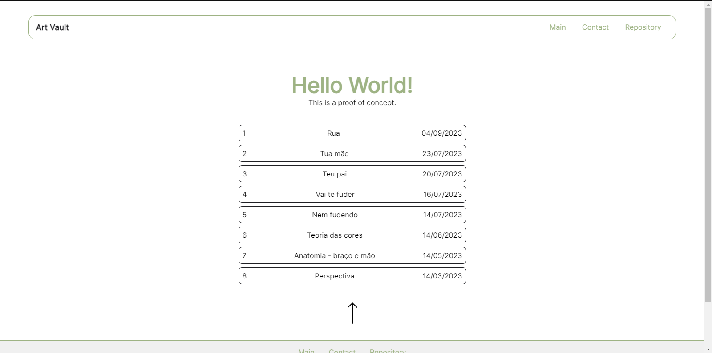
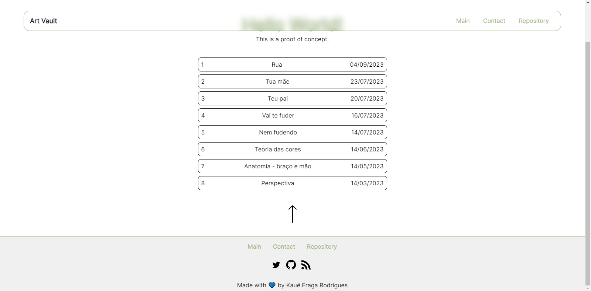

# Prova de Conceito | [Art Vault](https://github.com/kauefraga/av) (:brazil:)


> 🦜 Testando alguns estilos para um possível site para o 'Art Vault'.

### 🖼 Imagens




## ⬇ Como instalar e rodar

1. Clonar o repositório
2. Abrir o arquivo `web/index.html` no navegador ou instalar o pacote [Serve](https://www.npmjs.com/package/serve) pelo NPM.

```bash
# (1)
git clone https://github.com/kauefraga/poc-av.git
cd poc-av

# (2)
./web/index.html

# Ou use o Serve

npm i -g serve # use o gerenciador de pacote que preferir
serve
```

## ⚡ Improvements

- Accessibility
- Responsivity (currently, it only works in desktop)
- Create size variables, organize the css better
- Put more information about the project (more description) 

## 🧻 Recursos e inspirações

Lista de conteúdos e referências que consumi para criar este projeto:

- HTML/CSS - A dupla dinâmica
- [Serve](https://www.npmjs.com/package/serve)
- [Artigo sobre 60-30-10](https://www.alura.com.br/artigos/regra-60-30-10-ui-design)
- [Feministech](https://feministech.com.br) - Me inspirei diretamente no design <3.

## 📝 Licença

Este projeto está sob licença do MIT - Veja a [LICENÇA](https://github.com/kauefraga/poc-av/blob/main/LICENSE) para mais informações.
